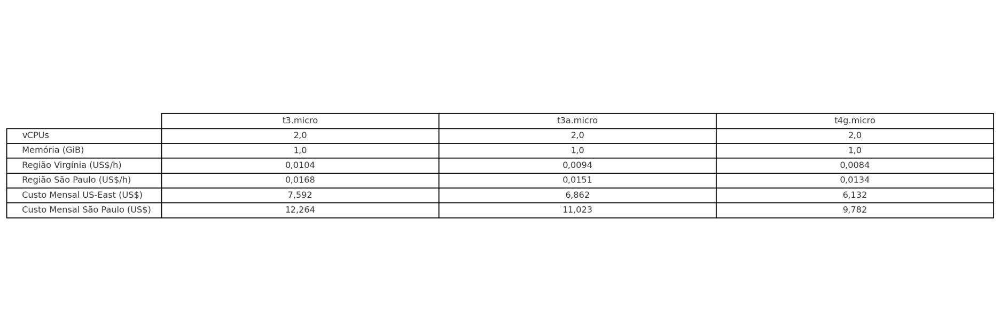
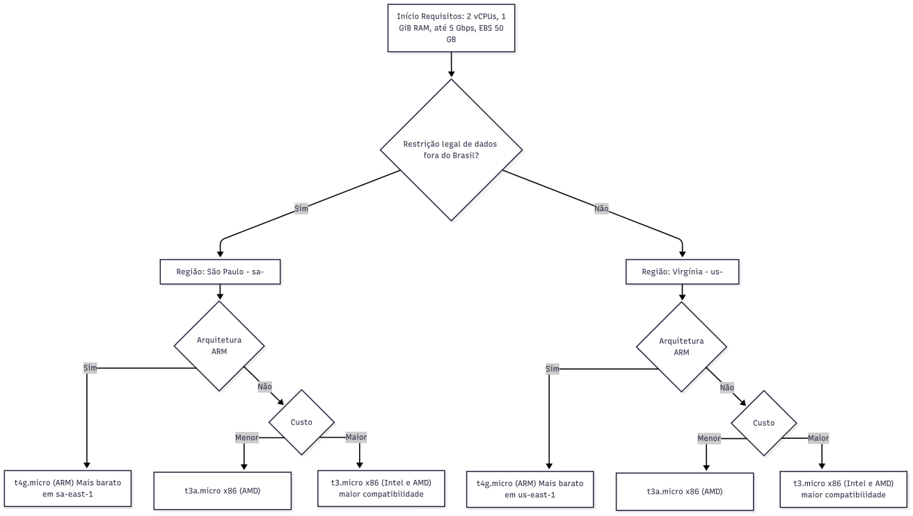

# FIAP - Faculdade de Informática e Administração Paulista

<p align="center">
<a href= "https://www.fiap.com.br/"></a>
</p>

<br>

# FarmTech na era da cloud computing

## Nome do grupo

Rumo ao NEXT!

## 👨‍🎓 Integrantes:

- Felipe Livino dos Santos (RM 563187)
- Daniel Veiga Rodrigues de Faria (RM 561410)
- Tomas Haru Sakugawa Becker (RM 564147)
- Daniel Tavares de Lima Freitas (RM 562625)
- Gabriel Konno Carrozza (RM 564468)

## 👩‍🏫 Professores:

### Tutor(a)

- Leonardo Ruiz Orabona

### Coordenador(a)

- ANDRÉ GODOI CHIOVATO

## 📜 Descrição

*Este repositório contém o código e os artefatos desenvolvidos na Fase 5 do projeto acadêmico FarmTech Solutions, cujo objetivo é aplicar técnicas de Machine Learning para prever o rendimento de safras agrícolas a partir de variáveis climáticas e de solo. A base de dados utilizada, disponível no arquivo crop_yield.csv, inclui informações como cultura, precipitação, umidade específica, umidade relativa, temperatura a 2 metros e o rendimento em toneladas por hectare.*

*A solução proposta envolve inicialmente uma análise exploratória dos dados, seguida pela aplicação de métodos de aprendizado não supervisionado, como clusterização, para identificar tendências de produtividade entre culturas e possíveis cenários discrepantes (outliers). Em paralelo, foram desenvolvidos cinco modelos preditivos baseados em algoritmos de regressão supervisionada distintos, que permitem estimar o rendimento das safras a partir das condições fornecidas. Os modelos foram avaliados de acordo com métricas adequadas ao problema, possibilitando a comparação de desempenho e a identificação de pontos fortes e limitações da abordagem.*

*Todo o fluxo de trabalho foi documentado em um notebook Jupyter, que organiza o processo em células de código Python comentadas e células de markdown explicativas, garantindo a reprodutibilidade e clareza da solução. Como complemento, foi produzido um vídeo de demonstração, com até cinco minutos de duração, apresentando a execução prática do notebook e os principais resultados obtidos.*

## 📁 Estrutura de pastas
```
challenge-fase5-FIAP/  
├── assets/                          # Imagens, diagramas e outros arquivos visuais
│  
├── calculadora_AWS/                 # Arquivos de dados utilizados no projeto
│   ├── tabela_de_precos_aws.webp    # Imagem da tabela de preços relacionada aas calculadoras da AWS
│   └── diagrama_de_decisao_aws.webp # Imagem do diagrama de decisão na análise da calculadora AWS
│
├── data/                            # Arquivos de dados utilizados no projeto
│   └── crop_yield.csv               # Dataset usado para treino do modelo
│
├── ir_alem/                         # Arquivos do projeto IR ALÉM
│   ├── data/                        # Arquivos de dados utilizados no projeto
│       └── crop_yield_data.csv      # Dataset usado para treino do modelo      
│   ├── notebooks/                   # Notebook com análise e machine learning  
│       └── main-ir-alem.ipynb       # Implementação e treino do modelo de ML "IR ALÉM"
│   ├── wokwi/                       # Arquivos do simulador Wokwi (ESP32)
│       └── diagram.json             # Diagrama do circuito
│       └── libraries.txt            # Bibliotecas necessárias
│       └── sketch.ino               # Código da simulação (Arduino)
│       └── wokwi-project.txt        # Configuração do projeto Wokwi
│   └── requirements.txt             # Imagem exportada do Diagrama ER
│
├── notebooks/                       # Notebook com análise e machine learning
│   └── pbl_fase4.ipynb              # Implementação e treino do modelo de ML entrega 1
│
├── README.md                        # Documentação do projeto
```

## Entrega 1: Análise e Modelagem de Dados (Notebook Jupyter) 

*Este repositório apresenta uma solução de **análise exploratória** e **modelagem preditiva** aplicada a dados com variáveis como temperatura, umidade, precipitação e cultura (crop), visando compreender padrões e **estimar o rendimento (yield)**. 
O propósito deste README é oferecer uma visão introdutória da solução e **conduzir você diretamente ao Jupyter Notebook**, onde está todo o passo a passo executável e a descrição completa.*

> 🔎 **Onde está o passo a passo?**  
> Todo o fluxo detalhado — da exploração de dados ao treinamento e à avaliação — está no arquivo **`_pbl_fase4.ipynb`** contido na pasta **`notebook`**. Abra-o e execute as células na sequência indicada.

## 🎥 Vídeo Demonstrativo
Confira o funcionamento do projeto neste vídeo demonstrativo:
▶️ [Assista ao vídeo no YouTube](https://youtu.be/IVPD5y_hspw)

---

**🎯 Objetivos**

O objetivo principal é construir um modelo de regressão capaz de prever o rendimento de uma cultura (em toneladas por hectare) a partir de um conjunto de dados que inclui informações sobre precipitação, umidade, temperatura e o tipo de cultura plantada como tambem: 

- Organizar e explorar o conjunto de dados (EDA).
- Preparar os dados para modelagem (limpeza, normalização/escala, divisão em treino e teste).
- Investigar estrutura de grupos/segmentos (clusterização) quando relevante.
- Treinar e comparar múltiplos modelos de regressão.
- Avaliar desempenho com métricas adequadas (ex.: **MAE** e **R²**).
- Selecionar o melhor modelo e registrar aprendizados/insights.

---

**🛠️ Metodologia Aplicada**

O desenvolvimento do modelo seguiu as seguintes etapas principais:

1. **Análise Exploratória de Dados (EDA)**: Investigação inicial dos dados para entender suas características, distribuições e correlações entre as variáveis. Foi verificado que a base não possuía dados faltantes, mas apresentava variáveis em escalas muito diferentes.
2. **Pré-processamento**: Transformação da variável categórica Crop em formato numérico utilizando One-Hot Encoding e padronização das features numéricas com StandardScaler para normalizar suas escalas.
3. **Clusterização (K-Means)**: Aplicação do Método do Cotovelo (Elbow Method) para identificar o número ideal de clusters (k=4) e segmentar os dados em grupos com características de rendimento similares (baixo, médio-baixo, médio e alto rendimento).
4. **Treinamento e Avaliação de Modelos**: Foram treinados e avaliados cinco modelos de regressão para encontrar o de melhor performance.

> 💡 Observação: os detalhes, gráficos e justificativas de cada etapa estão no notebook.

**🤖 Modelos Testados**

Foram avaliados os seguintes modelos de regressão:

- Regressão Linear
- Árvore de Decisão
- Random Forest (Modelo Campeão)
- Support Vector Regressor (SVR)
- Gradient Boosting

*O modelo Random Forest Regressor foi o que apresentou o melhor desempenho, com o menor Erro Absoluto Médio (MAE) e um Coeficiente de Determinação (R²) robusto.*

---

## 🧩 Tecnologias e Bibliotecas
- **Python 3.10+**
- **Jupyter Notebook / JupyterLab**
- **pandas**, **scikit-learn**, **matplotlib**, **seaborn**

Sugestão de `requirements.txt` minimalista:
```
pandas
scikit-learn
matplotlib
seaborn
jupyter
```
(Ajuste versões conforme seu ambiente.)

## 🔧 Como executar o código

Para replicar a análise e treinar os modelos, siga os passos abaixo:

1. Clone este repositório para a sua máquina local.
2. Instale as dependências necessárias (recomenda-se o uso de um ambiente virtual):
```
pip install pandas matplotlib seaborn scikit-learn
```
Execute o Notebook Jupyter: Abra e execute o arquivo `pbl_fase4.ipynb` em um ambiente compatível (como Jupyter Lab ou VS Code).

---

## Entrega 2: Estimativa de Custos na Nuvem (AWS)

*Esta seção aborda a análise de custos para a hospedagem da API e do modelo de Machine Learning em uma estrutura de computação em nuvem, utilizando a Amazon Web Services (AWS). A análise compara custos entre diferentes regiões e tipos de instância para encontrar a solução mais viável considerando os requisitos técnicos e de negócio.*

1. Análise de Custo: São Paulo vs. Virgínia do Norte

Utilizando a Calculadora de Preços da AWS, foi realizada uma estimativa de custos para uma instância EC2 On-Demand com as seguintes configurações mínimas:

- Sistema Operacional: Linux
- vCPUs: 2
- Memória: 1 GiB
- Desempenho da Rede: Até 5 Gigabit
- Armazenamento (EBS): 50 GB (HD de Propósito Geral - gp3)
- A comparação foi feita entre as regiões de São Paulo (sa-east-1) e Virgínia do Norte (us-east-1), considerando as três instâncias que atendem aos requisitos.

**📷 Tabela de Preços AWS**


**Conclusão da Análise de Custo**

*Conforme observado na tabela, a instância mais barata, desconsiderando qualquer restrição, é a `t4g.micro` na região da Virgínia do Norte. Proporcionalmente, as instâncias localizadas em São Paulo são aproximadamente 50% mais caras que as equivalentes na Virgínia do Norte.*

2. Escolha da Instância e Justificativa
   
*Para auxiliar a responder essa pergunta, criamos um diagrama de decisão baseado em 3 variáveis: **restrições judiciais**, **compatibilidade com a arquitetura ARM** e **custos**.
Portanto, existindo a restrição legal e a necessidade de uma região mais próxima para uma menor latência no acesso aos dados, somente as instâncias da região de São Paulo são elegíveis. Sendo o stack compatível com arquitetura ARM, a opção `t4g.micro` seria a mais barata. Porém, nós optamos pela instância `t3a.micro`, pois ela apresenta um custo menor que  a t3.micro e uma compatibilidade maior do que a t4g.micro.*

O fluxograma abaixo ilustra o processo de decisão para a escolha da instância ideal, partindo dos requisitos técnicos e passando pelas restrições de negócio como localização e compatibilidade de arquitetura.

**Restrição Legal/Latência?**

- Sim ➡️ Prosseguir com a região de São Paulo.
- Não ➡️ Escolher t4g.micro na Virgínia do Norte (menor custo).

**Análise em São Paulo: Compatibilidade da Arquitetura?**

- Compatível com ARM? ➡️ Escolher t4g.micro (menor custo em SP).
- Incompatível com ARM? ➡️ Comparar instâncias x86 (t3a.micro vs. t3.micro).

**Diagrama de decisão**


## 🎥 Vídeo Demonstrativo da calculadora AWS.
Confira a demonstração da calculadora AWS neste video demonstrativo:
▶️ [Assista ao vídeo no YouTube](https://youtu.be/CYPGIqqn9D4 )

## 🚀 PROJETO “IR ALÉM”

**Ir Além: Classificação da Saúde de Plantações com ESP32**
Esta seção detalha a implementação de um sistema completo que utiliza um microcontrolador ESP32 e sensores para coletar dados em tempo real e um modelo de Machine Learning para classificar a saúde de plantações.

**Definição do Projeto**
O objetivo deste projeto é desenvolver um sistema que classifique a saúde de uma plantação em "Saudável" ou "Não saudável". Para isso, foi adotado um problema análogo com dados públicos: a previsão de rendimento agrícola (crop_yield), onde um rendimento alto pode ser associado a uma plantação saudável.

## 🔌 1. Simulador de Circuito – Wokwi (ESP32)

- **Conecta-se ao WiFi** automaticamente (`Wokwi-GUEST`).
- **Envio Web**
  - Forma JSON com campos `sensor`, `item`, `valor`, `timestamp`.
  - Envia via HTTP POST e exibe código de resposta.
- **Configura sensores e atuadores**:
  - **Sensor DHT22** (temperatura e umidade).
  - **Sensor de luminosidade** simula valor de luminosidade.
  - **Sensor potenciômetro (umidade do solo)** para simular **valores de umidade do solo**.
  - **Sensor potenciômetro (PH do solo)** para simular **valores de PH presentes no solo**.
  - **Botão** para simular um **estado de chuva** e controlar novas tarefas de uminade e PH do solo. 
- Coleta os dados a cada 5 segundos:
  - Temperatura e umidade do ar, umidade do solo, PH do solo, luminosidade (via LDR).
- **Funcionamento do botão para simular que esta chovendo**:
  - O circuito também inclui um botão para simular a ocorrência de chuva e um relé para o acionamento de uma bomba d'água, permitindo testes de resposta do sistema a eventos específicos.

  ## Resumo do Circuito

- **DHT22** — pino 19; use resistor de pull-up de 10 kΩ entre DATA e 3 V3.
- **Sensor de Umidade do Solo** — pino 35. 
- **Sensor de pH do Solo”** — pino 32.
- **LDR(luminosidade)** — pino 34 (ADC1_CH6); formar divisor com resistor de 10 kΩ.
- **Botão “CHUVA”** — pino 22; configurado como `INPUT`.
- **Alimentação** — ESP32 DevKit v1 alimentado por 3V e 5V USB;

## Arquitetura do circuito feito no worki.com

<image src="ir_alem/wokwi/woki.png" alt="Circuito do projeto" width="100%" height="100%">

**Análise do Código do Circuito**
O código em C++ (`sketch.ino`) para o ESP32 é estruturado para garantir a coleta contínua e o envio confiável dos dados dos sensores. Abaixo estão os principais blocos de funcionamento:

Configuração Inicial (setup):

Inicializa a comunicação serial para debug.

- Configura os pinos dos sensores como entradas (INPUT e INPUT_PULLUP).
   - Inicializa a comunicação serial para debug.
   - Configura os pinos dos sensores como entradas (`INPUT` e `INPUT_PULLUP`).
   - Inicia o sensor DHT22.
   - Estabelece a conexão com a rede Wi-Fi e configura um timer para reconexão automática em caso de falha.

- Loop Principal (`loop`):
   - **Leitura dos Sensores**: A cada 5 segundos (INTERVALO_COLETA_MS), o loop principal executa a leitura de todos os sensores conectados. Os valores analógicos (LDR, umidade do solo, pH) são mapeados para escalas padronizadas (0-1000 para umidade, 0-140 para pH).
   - **Simulador de Chuva**: O código monitora continuamente o estado do botão. Ao ser pressionado, ele inverte o estado da variável chovendo, simulando a ocorrência ou a parada da chuva. Um mecanismo de debounce evita leituras múltiplas e instáveis.
   - **Criação de Tarefa**: Após cada ciclo de leitura, os dados são agrupados em uma estrutura (SensorDataPayload) e uma nova tarefa (tarefaEnvioWebService) é criada para lidar com o envio dos dados pela rede, garantindo que o loop principal não seja bloqueado.

- Envio de Dados (tarefaEnvioWebService):
   - **Formatação JSON**: A tarefa formata os dados coletados, incluindo um timestamp obtido via NTP, em um objeto JSON.
   - **Requisição HTTP POST**: Utilizando a biblioteca HTTPClient, a tarefa envia os dados formatados para a URL do web service.
   - **Feedback**: O código de resposta da requisição é impresso no monitor serial, permitindo verificar se o envio foi bem-sucedido.

##🤖 2. Desenvolvimento do Modelo de Machine Learning
A implementação do modelo preditivo foi realizada em Python, utilizando bibliotecas como `Scikit-learn` e `Pandas`, com o objetivo de realizar a previsão do rendimento agrícola (`crop_yield_data`).

Para tornar o desafio mais realista, a implementação do modelo preditivo foi realizada com um dataset público que simula as condições de uma fazenda real.
- **Data set utilizado**: Para o treinamento, foi utilizado um dataset encontrado na plataforma Kaggle, contendo dados realistas sobre produção agrícola. Este conjunto de dados inclui informações como chuva, tamanho da fazenda, horas de sol, uso de fertilizantes e rendimento da colheita.
  - [➡️ Link para o Dataset no Kaggle: (https://www.kaggle.com/datasets/govindaramsriram/crop-yield-of-a-farm?resource=download)]
- **Análise Exploratória**: Foi realizada uma análise detalhada dos dados, incluindo a visualização de histogramas e uma matriz de correlação para entender a relação entre as features.
- **Treinamento e Validação**: Foram testados cinco algoritmos de regressão: Linear Regression, K-Neighbors Regressor, SVM, Bayesian Ridge e a ARD Regression. O modelo foi treinado com 80% dos dados e validado com os 20% restantes, com a ressalva de que a feature "qualidade do solo" foi removida para aumentar o realismo, uma vez que essa informação não seria coletada pelos sensores.
- **Melhor Modelo**: O K-Neighbors Regressor foi o que apresentou o melhor desempenho, com o menor erro quadrático médio (MSE) e uma acurácia (score) de aproximadamente 99.8% no conjunto de teste
  
## 🎥 Vídeo Demonstrativo DO PROJETO "IR ALÉM".
Confira a demonstração do circuito feito no wokwi e do modelo de machine learning neste video demonstrativo:
▶️ [Assista ao vídeo no YouTube](https://youtu.be/Si3Xjev7Ma4)


## 🔧 Como executar o código (IR ALÉM)

Para executar o código deste projeto, siga os passos abaixo:

Pré-requisitos:

- Python 3.8+ instalado
- Virtualenv

```
  pip install virtualenv
```

1. Circuito Wokwi

- **Clone o repositorio**

- A pasta `wokwi/` contida na pasta `ir_alem/` contém os arquivos do circuito virtual que simula um **ESP32** com sensores conectados.
- O circuito pode ser simulado diretamente no site [https://wokwi.com](https://wokwi.com), bastando importar os arquivos presente na pasta `/worki`:

-Certifique-se de que o ESP32 esteja conectado ao WiFi (Wokwi-GUEST)

O sketch irá:

- Coletar dados dos sensores (DHT, LDR, botões)
- Enviar os dados via HTTP para o WebService

2. **Execuçao do Modelo de Machine Learning**
Este projeto foi desenvolvido em **Python** e utiliza **Jupyter Notebook** para documentar todo o fluxo de análise de dados e Machine Learning.

### Pré-requisitos

- Python 3.9 ou superior  
- Jupyter Notebook ou Jupyter Lab  
- Bibliotecas Python:
  - `pandas`
  - `numpy`
  - `matplotlib`
  - `seaborn`
  - `scikit-learn`(from `sklearn.model_selection` import `train_test_split`)

> **Dica:** É recomendado criar um ambiente virtual antes de instalar as bibliotecas.

### Passo a passo

1. **Clonar o repositório**  
   ```bash
   git clone https://github.com/danivrf/challenge-fase5-FIAP.git
2. **Navegar até a pasta do projeto**
    ```bash
   cd Farmtech-fase5-FIAP
3. **Instalar as bibliotecas necessárias**
   ```bash
   pip install pandas numpy matplotlib seaborn scikit-learn
4. **Abrir o notebook**
   - Entre na pasta `ir_alem/`
   - abra a pasta `notebook/`
   - Abra o arquivo `.ipynb` no Jupyter Notebook ou Jupyter Lab
 5. **Executar o notebook**
    - Execute as células na ordem, que incluem:
        - Análise exploratória dos dados
        - Preparação do dataset
        - Construção e treinamento do modelo de Machine Learning
        - Visualizações e gráficos de resultados
 **Visualizar resultados**
    - Os gráficos e outputs do notebook mostram insights sobre os dados coletados pelos sensores e as predições do modelo.

## 📋 Licença

<p xmlns:cc="http://creativecommons.org/ns#" xmlns:dct="http://purl.org/dc/terms/"><a property="dct:title" rel="cc:attributionURL" href="https://github.com/agodoi/template">MODELO GIT FIAP</a> por <a rel="cc:attributionURL dct:creator" property="cc:attributionName" href="https://fiap.com.br">Fiap</a> está licenciado sobre <a href="http://creativecommons.org/licenses/by/4.0/?ref=chooser-v1" target="_blank" rel="license noopener noreferrer" style="display:inline-block;">Attribution 4.0 International</a>.</p>


